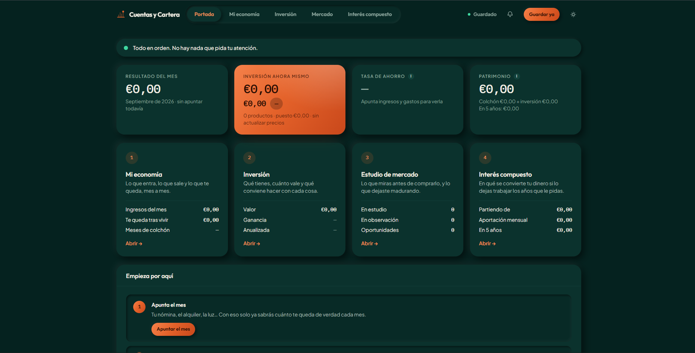
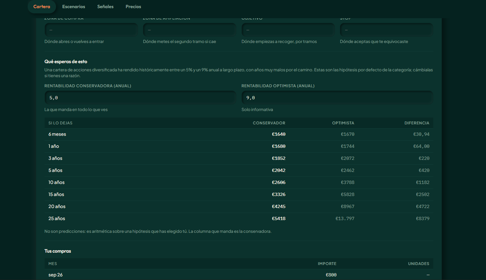
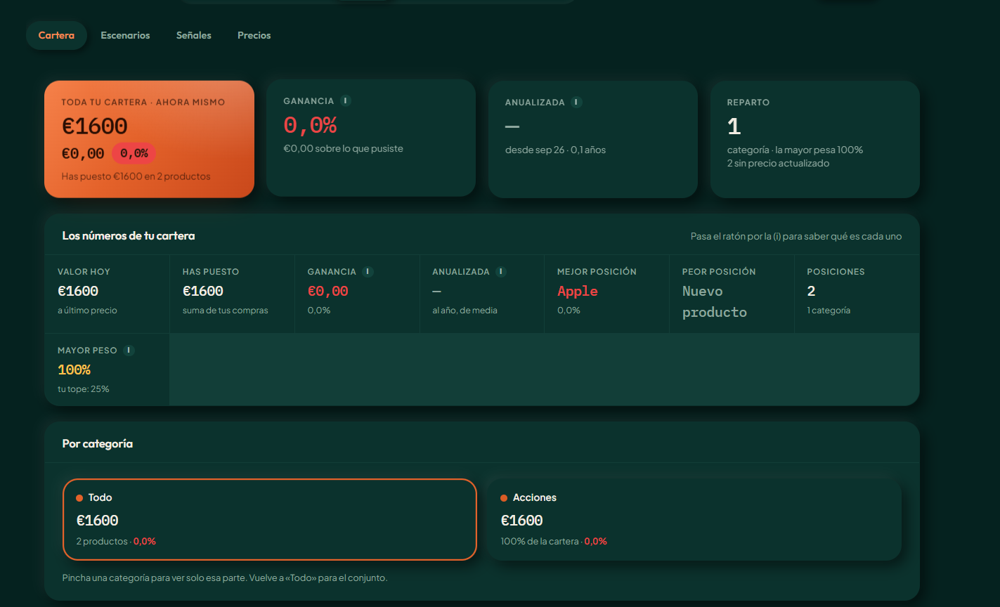

# Cuentas y Cartera

Aplicación web de finanzas personales e inversión a largo plazo. Lleva la
economía del mes, la cartera de inversión con precios reales de mercado, y
un método escrito para decidir qué comprar, qué mantener y qué vender.

Todo el frontend cabe en **un único fichero HTML** sin dependencias ni
framework: se abre, funciona, y se puede leer entero.



---

## Qué problema resuelve

Las aplicaciones de finanzas personales suelen hacer una de estas dos cosas:
o te enseñan en qué te gastas el dinero, o te enseñan cuánto vale tu cartera.
Casi ninguna te dice **qué hacer** con ninguna de las dos cosas.

Esta sí, y en un orden deliberado:

1. **Mi economía** — cuánto entra, cuánto sale, y cuánto te queda de verdad
   cada mes. Con el colchón separado de los gastos, porque el colchón no es
   un gasto: es dinero tuyo, solo que reservado.
2. **Inversión** — qué tienes, cuánto vale a precio de hoy, cuánto has
   ganado o perdido de verdad, y qué conviene hacer con cada posición.
3. **Mercado** — el estudio de lo que todavía no has comprado, con las
   cuentas de la empresa cargadas y un margen de seguridad calculado.
4. **Interés compuesto** — en qué se convierte tu dinero si lo dejas
   trabajar los años que le pidas.

La regla que atraviesa todo el proyecto: **la app calcula y avisa; decides
tú**. No hay recomendaciones de compra, no hay "productos destacados", y las
cifras que se enseñan por defecto son siempre las conservadoras.

---

## El método, resumido

Tres ideas que condicionan todo el código:

### No todo se valora igual

Es el error más caro de quien empieza, y no tiene nada de intuitivo. La app
clasifica cada producto en uno de tres tipos y le aplica una vara distinta:

| Tipo | Ejemplos | Cómo se juzga | La pregunta |
|---|---|---|---|
| **Genera dinero por sí solo** | Acciones, un piso alquilado, bonos | Se **valora**: ROIC, deuda, flujo de caja, PER, margen de seguridad | ¿Está barata? |
| **Es una cesta de otras cosas** | ETF, fondos indexados | Se **compara**: comisión, tamaño, domicilio, réplica | ¿Es el envase más barato para este índice? |
| **No genera nada** | Bitcoin, oro | Se **dimensiona**: solo cuánto pesa en la cartera | ¿Cuánto, no cuándo? |

Preguntarle el PER a un ETF no significa nada. Preguntarle el ROIC a un
lingote de oro, tampoco. La app lo sabe y no lo hace.

### Dos escenarios, y manda el conservador

Cada proyección se calcula por duplicado: una hipótesis conservadora y una
optimista. La que aparece en las decisiones es **siempre la conservadora**;
la optimista está solo para que veas el rango. La distancia entre las dos
líneas es tu margen de error.



El caso extremo es Bitcoin, cuyo escenario conservador es **0%**. No es
pesimismo: es honestidad. No genera beneficios, así que no hay nada que
proyectar. Lo que se compra ahí es escasez, y eso puede salir bien o no.

### Vender no es fracasar

Las señales (`Mantener` / `Valorar la venta` / `Toca decidir ya`) salen de
reglas fijas y verificables, no de una opinión, y cada tipo de producto se
mide con las suyas. Rojo nunca quiere decir "vende ahora": quiere decir
"siéntate hoy cinco minutos con esta posición y decide a conciencia". Muchas
veces la decisión correcta es mantener — y entonces lo que toca es escribir
por qué.

Por eso cada producto tiene una **tesis**: tres líneas explicando por qué lo
compraste y qué tendría que pasar para venderlo. Es lo único que dentro de
tres años te dirá si aguantar o salir.



---

## Arquitectura

La aplicación nació como Artefacto de Claude y se sacó a infraestructura
propia. El hosting contratado (Hostinger Business, compartido) no ejecuta
Node.js, así que la solución fue partirla en tres piezas:

```
   Navegador
       │
       │  (1) carga el HTML
       ▼
┌──────────────────┐
│    Hostinger     │   frontend/index.html — un solo fichero, sin build
│  ahorrainvierte  │   Protegido con contraseña de directorio
└──────────────────┘
       │
       │  (2) fetch con Authorization: Bearer <APP_TOKEN>
       ▼
┌──────────────────┐
│  Vercel Functions│   api/estado.js      → guardar y leer el estado
│   (Node.js)      │   api/mcp-proxy.js   → precios de mercado
└──────────────────┘   Las claves de API viven aquí, nunca en el navegador
       │                        │
       │ (3)                    │ (4)
       ▼                        ▼
┌──────────────┐   ┌────────────────────────────────────┐
│   Supabase   │   │ Twelve Data · Alpha Vantage        │
│  (Postgres)  │   │ Crypto.com                         │
└──────────────┘   └────────────────────────────────────┘
```

**Por qué esta separación.** El frontend es estático y puede vivir en
cualquier hosting barato. El backend existe por una única razón: que las
claves de las APIs de mercado y de la base de datos **no viajen nunca al
navegador**. Cualquiera que abra el código fuente de la página no encuentra
ni una credencial.

### El repositorio

```
frontend/index.html               La aplicación entera (HTML + CSS + JS)
api/_common.js                    CORS, comprobación de token, lectura de cuerpo
api/estado.js                     GET/POST del estado contra Supabase
api/mcp-proxy.js                  Proxy hacia las tres APIs de mercado
supabase/schema.sql               La tabla y sus permisos
.github/workflows/deploy-frontend.yml   Sube el frontend a Hostinger por FTP
DESPLIEGUE.md                     Cómo montarlo todo desde cero
AVERIAS.md                        Qué hacer cuando algo falla
ARQUITECTURA.md                   El plan multiusuario: cuentas, 2FA y aislamiento
SEGURIDAD.md                      Modelo de amenazas y contramedidas
```

### Decisiones de diseño que merecen explicación

**Un solo fichero HTML, sin framework ni build.** Son unas 6.700 líneas.
A cambio: no hay `npm install`, no hay versiones que se pudran, no hay paso
de compilación que se rompa en dos años, y el despliegue del frontend es
copiar un fichero. Para una aplicación de un solo usuario, el coste de
mantenimiento de un framework no se paga solo.

**Una única fila en la base de datos.** La tabla `estado` guarda todo el
estado de la aplicación como un JSON en una fila con `id = "principal"`.
Es una app personal: no hay usuarios, no hay relaciones, no hay consultas
analíticas. Un esquema normalizado aquí sería ceremonia sin beneficio.

**Autenticación por token compartido.** No hay registro, ni login, ni
cuentas. Una cadena secreta (`APP_TOKEN`) que se escribe una vez, se guarda
en `localStorage` y viaja como `Authorization: Bearer` en cada llamada. El
backend la compara y punto. Para un usuario único, OAuth sería construir un
aeropuerto para ir a comprar el pan.

**RLS activado sin ninguna política.** En Supabase, la tabla tiene Row Level
Security activado y cero políticas — es decir, deniega todo. El backend
entra con la clave `service_role`, que se salta RLS por diseño. Así, si
algún día se filtrase la clave pública, seguiría sin poder leer nada.

**El proxy imita la forma antigua de las respuestas.** `api/mcp-proxy.js`
llama a las APIs REST reales pero devuelve los datos con la **misma forma**
que tenían cuando la app vivía dentro de Claude y usaba conectores MCP. Fue
deliberado: permitió mover la aplicación a producción sin tocar ni una línea
de la lógica de negocio, que era la parte cara y ya probada.

---

## Puesta en marcha

Necesitas cuentas (todas con plan gratuito suficiente) en GitHub, Vercel,
Supabase, [Twelve Data](https://twelvedata.com) y
[Alpha Vantage](https://www.alphavantage.co/support/#api-key), más un
hosting estático cualquiera para el frontend.

**El proceso completo está en [`DESPLIEGUE.md`](./DESPLIEGUE.md)**, paso a
paso y en orden. No hay atajos: cada paso necesita algo del anterior.

Variables de entorno que hay que configurar en Vercel:

| Variable | Qué es |
|---|---|
| `APP_TOKEN` | La contraseña de la app. Te la inventas tú, larga y aleatoria |
| `TWELVE_DATA_KEY` | Clave de Twelve Data (acciones y ETF) |
| `ALPHA_VANTAGE_KEY` | Clave de Alpha Vantage (respaldo y tipo de cambio) |
| `SUPABASE_URL` | `https://<id-del-proyecto>.supabase.co` — **con protocolo y dominio completos** |
| `SUPABASE_SERVICE_KEY` | La clave secreta de Supabase (`sb_secret_…` o la `service_role` heredada) |
| `ALLOWED_ORIGIN` | Dominios autorizados, separados por comas, con `https://` y sin barra final |
| `LIMITE_DIARIO` | Opcional. Consultas de mercado por persona y día (300 por defecto). Solo cuentan las que salen a internet: lo que sirve la caché es gratis |

Si algo no funciona, **[`AVERIAS.md`](./AVERIAS.md)** recoge los fallos
reales que aparecieron en el primer despliegue, con sus síntomas y su
solución. Los cuatro se manifestaban igual desde fuera —la aplicación en
blanco, con todo a cero— y ninguno tenía que ver con el motivo aparente.

---

## Hacia dónde va

La versión actual es de un solo usuario, con un token compartido. El
siguiente paso es convertirla en multiusuario con cuentas propias,
verificación en dos pasos por TOTP y aislamiento entre perfiles garantizado
por PostgreSQL —no por el código de la aplicación.

- **[`ARQUITECTURA.md`](./ARQUITECTURA.md)** — el diseño al que se va, el
  modelo de datos con Row Level Security, y el plan de migración en siete
  etapas sin cortes de servicio.
- **[`SEGURIDAD.md`](./SEGURIDAD.md)** — modelo de amenazas, superficie de
  ataque, riesgos que se aceptan a conciencia, obligaciones legales y plan
  de respuesta ante incidentes.

---

## Límites conocidos

- **Cuotas gratuitas**: Twelve Data admite 800 peticiones al día; Alpha
  Vantage, unas 25 al día y una por segundo. Con una cartera de diez
  posiciones actualizando una vez al día sobra de largo.
- **Un solo usuario**. No está pensada para compartir: quien tenga el token
  ve y edita toda la cartera.
- **Sin histórico de precios**. Se guarda el último precio conocido de cada
  producto, no la serie completa. Las gráficas de evolución salen de tus
  propios apuntes mensuales, no del mercado.
- **Los índices no se pueden pedir directamente** (S&P 500, Nasdaq…): hay
  que usar su ETF como aproximación (`SPY`, `QQQ`, `DIA`).

---

## Nota final

Esto no es asesoramiento financiero, ni pretende serlo. Es una herramienta
de contabilidad y aritmética que hace explícitas las hipótesis con las que
trabaja, para que las puedas discutir. Cada cifra proyectada lleva al lado
de dónde sale y con qué supuesto se ha calculado, precisamente para que no
te la creas sin mirarla.
